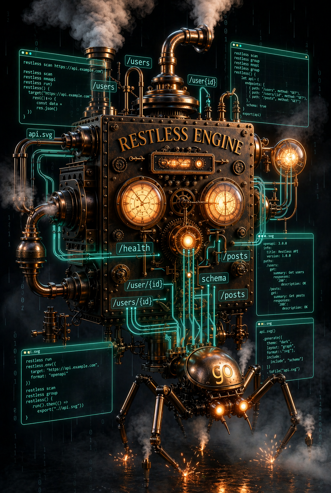

# restless

Escape goto-10 development.

Understand an unfamiliar API or repo in seconds:

    restless map .

Restless shows you what exists before you know what you're looking for.

It discovers structure automatically:

- endpoints
- schema hints
- topology
- surface changes over time

No config required.

---

## Why restless exists

Modern systems are bigger than their documentation.

When opening something unfamiliar, the first problem isn’t editing code.

It’s orientation.

Restless answers:

> what actually exists here?

before you even know what to ask.

---

## What restless is

Restless is situational awareness for developers.

Use it when:

- onboarding to a repo
- exploring an unfamiliar API
- validating documentation drift
- auditing service surfaces
- preparing refactors
- comparing environments

Run it early.
Run it often.
Avoid the loop.

---

## Example

Map a repository surface:

    restless map .

Explore a remote API safely:

    restless scan https://example-api.dev

Compare structural changes between runs:

    restless diff previous.scan current.scan

---

## Safe by default

Restless explores remote systems conservatively.

Discovery uses only:

- GET
- HEAD
- OPTIONS

No mutation.
No guessing hidden state.
No surprises.

---

## What restless discovers

Depending on input source:

From APIs:

- endpoints
- parameter shapes
- response structure hints
- traversal topology

From repositories:

- route definitions
- service boundaries
- structural relationships
- surface entry points

Across runs:

- surface drift
- added endpoints
- removed endpoints
- topology changes

---

## Why this matters

Engineering teams spend time reconstructing structure that already exists.

Restless reduces:

- onboarding time
- integration risk
- reverse-engineering effort
- documentation trust gaps

This lowers engineering cost per decision.

---

## Philosophy

Documentation describes intention.

Surfaces describe reality.

Restless maps the surface.

---

## Design principles

Restless is built to:

- work without configuration
- provide signal immediately
- remain safe by default
- support iterative exploration
- stay useful in unfamiliar systems

It behaves like a developer’s field tool, not a platform.

---

## Installation

Example (adjust for your environment):

    cargo install restless

or clone:

    git clone https://github.com/bspippi1337/restless
    cd restless
    cargo build --release

---

## Quick workflow

Typical usage pattern:

    restless map .
    restless scan https://service.internal
    restless diff yesterday.scan today.scan

Understand structure first.
Make decisions second.

---

## Stability and packaging

Restless follows:

- reproducible builds
- XDG state handling
- upstream man page support
- distribution-friendly layout

Designed for long-term reliability in real environments.

---

## Architecture overview (approximate)

## Vision

Developers should never start blind.

Restless makes systems legible.

MacGyverize the world.
