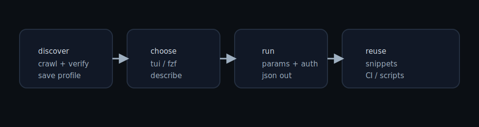

# Restless

Terminal-native API discovery and interaction engine.

<p align="center">
  
</p>

Quickstart:
```bash
restless doctor
restless discover openai.com --verify --budget-seconds 20 --budget-pages 8 --save-profile openai
restless tui
```

Guides:
- Getting started: GETTING-STARTED.md
- Workflows: WORKFLOWS.md
- Combos: COMBOS.md
- Animations: ANIMATIONS.md

<p align="center">
  
</p>
